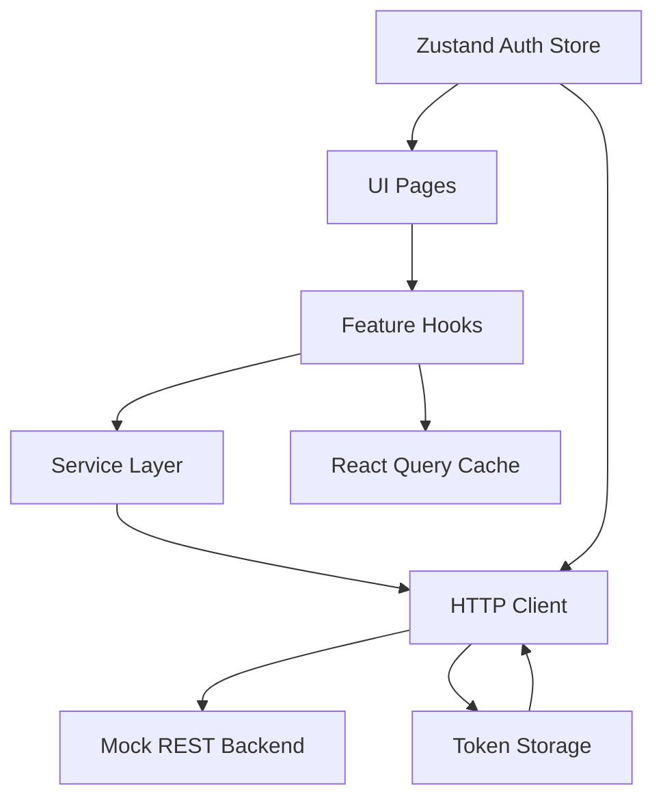

# CryptoFolio Control Center

Production-style SaaS dashboard portfolio project built with React 19, TypeScript, Vite, Zustand, TanStack React Query, Tailwind CSS, shadcn/ui, Zod, React Router, Framer Motion, Recharts, and Axios.

This project was upgraded from a UI-only dashboard into a backend-ready SaaS application that demonstrates:

- JWT-style authentication with refresh logic
- centralized Axios API client architecture
- feature-based frontend organization
- typed service modules and DTO contracts
- React Query pagination, caching, optimistic updates, and invalidation
- role-based protected routes
- realistic admin modules for analytics, portfolio, notifications, billing, team, settings, and activity logs
- production-grade error, loading, offline, and unauthorized UX

## Why This Project Is Strong for Clients

This repo is designed to help attract:

- SaaS founders who want a frontend engineer that understands product architecture
- fintech clients who need secure authenticated dashboards
- AI SaaS clients who want scalable frontend foundations
- internal admin panel buyers who care about permissions and operational tooling
- Upwork clients looking for premium frontend delivery, not just UI polish

What increases trust here:

- the frontend is structured around domains and services instead of page-level mock data
- auth behavior mirrors real SaaS delivery, including session restore and token refresh
- API contracts are typed and reusable, making backend handoff much cleaner
- React Query patterns show real production habits instead of beginner fetch-in-component code
- admin modules demonstrate believable business workflows, not generic widget cards

## Demo Credentials

- Email: `owner@company.com`
- Password: `SecurePass1!`

## Tech Stack

- React 19
- TypeScript
- Vite
- Zustand
- TanStack React Query
- Tailwind CSS
- shadcn/ui
- Zod
- React Router
- Framer Motion
- Recharts

## Key Architectural Upgrades

### 1. Centralized API Platform

Files:

- [src/services/api/http-client.ts](src/services/api/http-client.ts)
- [src/services/api/token-storage.ts](src/services/api/token-storage.ts)
- [src/config/env.ts](src/config/env.ts)

What changed:

- all requests now flow through a single client
- auth token injection is automatic
- 401 responses trigger refresh attempts
- timeout handling and standardized API errors are centralized
- API base URLs are environment-driven

Why premium clients care:

- this is the difference between a demo app and maintainable production frontend infrastructure

### 2. Realistic Auth Flow

Files:

- [src/features/auth/stores/auth.store.ts](src/features/auth/stores/auth.store.ts)
- [src/features/auth/hooks/useAuth.ts](src/features/auth/hooks/useAuth.ts)
- [src/components/ProtectedRoute.tsx](src/components/ProtectedRoute.tsx)

What changed:

- login, signup, logout, refresh, session restore, and remember-me are implemented
- routes are protected
- role-restricted routes are included for billing and team management
- unauthorized sessions are cleared safely and redirected

Why premium clients care:

- founders and product teams want engineers who think about auth behavior, not just auth screens

### 3. Mock Backend That Feels Real

File:

- [src/services/api/mock-backend.ts](src/services/api/mock-backend.ts)

What changed:

- a seeded mock REST backend now responds to realistic module endpoints
- data persists in browser storage
- auth tokens are issued and validated
- dashboard sections use believable business data instead of static UI arrays

Why premium clients care:

- this shows backend readiness immediately, even before a live server exists

### 4. React Query Production Patterns

Files:

- [src/lib/query-client.ts](src/lib/query-client.ts)
- [src/lib/query-keys.ts](src/lib/query-keys.ts)
- [src/features/portfolio/hooks/usePortfolio.ts](src/features/portfolio/hooks/usePortfolio.ts)
- [src/features/notifications/hooks/useNotifications.ts](src/features/notifications/hooks/useNotifications.ts)

What changed:

- reusable query keys
- stale times and cache policies
- paginated queries
- optimistic notification updates
- invalidation and refetch patterns
- placeholder caching for smoother table transitions

Why premium clients care:

- these are the habits teams expect from experienced frontend engineers working at scale

### 5. Real Business Modules

Representative files:

- [src/pages/dashboard/DashboardOverview.tsx](src/pages/dashboard/DashboardOverview.tsx)
- [src/pages/dashboard/portfolio/AssetsPage.tsx](src/pages/dashboard/portfolio/AssetsPage.tsx)
- [src/pages/dashboard/portfolio/TransactionsPage.tsx](src/pages/dashboard/portfolio/TransactionsPage.tsx)
- [src/pages/dashboard/notifications/NotificationsPage.tsx](src/pages/dashboard/notifications/NotificationsPage.tsx)
- [src/pages/dashboard/billing/BillingHistoryPage.tsx](src/pages/dashboard/billing/BillingHistoryPage.tsx)
- [src/pages/dashboard/team/TeamMembersPage.tsx](src/pages/dashboard/team/TeamMembersPage.tsx)
- [src/pages/dashboard/activity/ActivityLogsPage.tsx](src/pages/dashboard/activity/ActivityLogsPage.tsx)

Included modules:

- executive dashboard overview
- portfolio assets
- allocation breakdown
- transaction history
- analytics performance
- analytics funnel history
- notification center
- settings sync
- billing history
- team member management
- activity logs

Why premium clients care:

- this makes the project feel like a real SaaS control center rather than a template dashboard

## Architecture Map



## Folder Structure

```text
src/
  components/
    app/
    auth/
    layout/
    ui/
  config/
    env.ts
  features/
    activity/
    analytics/
    auth/
    billing/
    notifications/
    portfolio/
    settings/
    team/
  lib/
    query-client.ts
    query-keys.ts
  pages/
    auth/
    dashboard/
  services/
    api/
    activity.service.ts
    analytics.service.ts
    auth.service.ts
    billing.service.ts
    notification.service.ts
    portfolio.service.ts
    settings.service.ts
    team.service.ts
  types/
```

## Local Setup

```bash
npm install
npm run dev
```

Optional environment variables:

```bash
cp .env.example .env
```

## Build Verification

Verified locally:

- `npx tsc --noEmit`
- `npm run build`

## Notes for Real Backend Integration

This project is intentionally structured so the mock backend can be replaced cleanly.

Recommended upgrade path:

1. replace the mock fetch handler with a real API base URL
2. keep the existing service layer contracts
3. connect refresh token behavior to your real auth backend
4. preserve the existing React Query hooks so UI pages remain mostly unchanged

## Portfolio Positioning

If you use this on Upwork, position it as:

- a production-style SaaS admin dashboard
- a frontend architecture sample with real auth and data patterns
- a dashboard system built for fintech, AI SaaS, and operations products

That framing will usually perform much better than calling it just a “React dashboard”.
